# Project 2  Light Up A Single LED

## Descripció

La placa base Micro:bit consta de 25 díodes emissors de llum, 5 peces en un grup, que corresponen als eixos x i y, forjant una matriu de 5 * 5. A més, cada díode es localitza en el punt dels eixos x i y.

Virtualment, podem controlar un LED establint punts de coordenades. Per exemple:
- Establir el punt de coordenades (0，0) permet encendre el LED a la fila 1 i la columna 1.
- Encendre el LED a la fila 1 i la columna 3, s'estableix amb les coordenades (2，0).

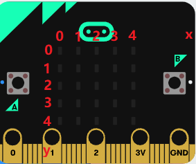

## Components necessaris

<table>
  <tr>
   <td>

>>>>>  gd2md-html alert: inline image link here (to images/image2.png). Store image on your image server and adjust path/filename/extension if necessary.  (<a href="#">Back to top</a>)(<a href="#gdcalert3">Next alert</a>) >>>>> 

   </td>
   <td>

>>>>>  gd2md-html alert: inline image link here (to images/image3.jpg). Store image on your image server and adjust path/filename/extension if necessary.  (<a href="#">Back to top</a>)(<a href="#gdcalert4">Next alert</a>) >>>>> 

   </td>
   <td>
   </td>
  </tr>
  <tr>
   <td>Micro:bit * 1
   </td>
   <td>USB Cable * 1
   </td>
   <td>
   </td>
  </tr>
</table>

**3. Test Code**

You can upload the code directly from the tutorial (read the "Development Environment Configuration" file if in doubt). 

Or add the code blocks manually: 

A. Click“Led”→“more”→“led enable false”

B. Put it into the“on start”block, click the drop-down triangle button to select“true”.

>>>>>  gd2md-html alert: inline image link here (to images/image4.png). Store image on your image server and adjust path/filename/extension if necessary.  (<a href="#">Back to top</a>)(<a href="#gdcalert5">Next alert</a>) >>>>> 

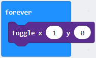

 (2) A. Enter“Led”→“toggle x 0 y 0”block;

B. Combine it with“forever”，alter“x 0”to“x 1”.

>>>>>  gd2md-html alert: inline image link here (to images/image5.png). Store image on your image server and adjust path/filename/extension if necessary.  (<a href="#">Back to top</a>)(<a href="#gdcalert6">Next alert</a>) >>>>> 

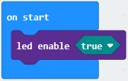

(3) A. Enter“Basic”→“pause (ms) 100”from“

B. Then move it below the“toggle x1 y0”block, and set the delay time to  500ms.

>>>>>  gd2md-html alert: inline image link here (to images/image6.png). Store image on your image server and adjust path/filename/extension if necessary.  (<a href="#">Back to top</a>)(<a href="#gdcalert7">Next alert</a>) >>>>> 

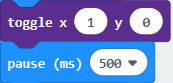

(4) Duplicate code string

>>>>>  gd2md-html alert: inline image link here (to images/image7.png). Store image on your image server and adjust path/filename/extension if necessary.  (<a href="#">Back to top</a>)(<a href="#gdcalert8">Next alert</a>) >>>>> 

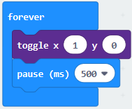
once and place it into“forever”block.

>>>>>  gd2md-html alert: inline image link here (to images/image8.png). Store image on your image server and adjust path/filename/extension if necessary.  (<a href="#">Back to top</a>)(<a href="#gdcalert9">Next alert</a>) >>>>> 

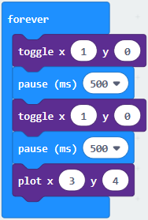

(5) A. Enter“Led”→“plot x 0 y 0”

B. Keep it beneath block“pause(ms)500”, then set to“plot x 3 y 4”.

>>>>>  gd2md-html alert: inline image link here (to images/image9.png). Store image on your image server and adjust path/filename/extension if necessary.  (<a href="#">Back to top</a>)(<a href="#gdcalert10">Next alert</a>) >>>>> 

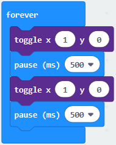

(6) Replicate“pause (ms) 500”once and keep it below the block“plot  x3y4”

>>>>>  gd2md-html alert: inline image link here (to images/image10.png). Store image on your image server and adjust path/filename/extension if necessary.  (<a href="#">Back to top</a>)(<a href="#gdcalert11">Next alert</a>) >>>>> 

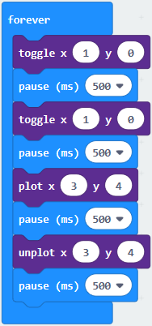

Click“Led”→“unplot x 0 y 0”and set to“unplot x3 y 4”; 

Lay down it beneath“pause (ms) 500”block

Copy“pause (ms) 500”block once, and keep it below the“unplot x3 y 4 block.

>>>>>  gd2md-html alert: inline image link here (to images/image11.png). Store image on your image server and adjust path/filename/extension if necessary.  (<a href="#">Back to top</a>)(<a href="#gdcalert12">Next alert</a>) >>>>> 

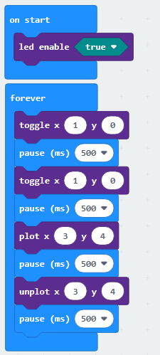

**Complete Program：**

       

>>>>>  gd2md-html alert: inline image link here (to images/image12.png). Store image on your image server and adjust path/filename/extension if necessary.  (<a href="#">Back to top</a>)(<a href="#gdcalert13">Next alert</a>) >>>>> 

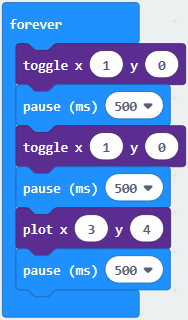

**4. Test Result**

Upload program and plug in micro:bit via USB port, the LED at coordinate point (1,0) flashes for 0.5s, then the LED at (3,4）blinks for 0.5s, alternately.

>>>>>  gd2md-html alert: inline image link here (to images/image13.png). Store image on your image server and adjust path/filename/extension if necessary.  (<a href="#">Back to top</a>)(<a href="#gdcalert14">Next alert</a>) >>>>> 

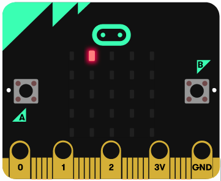

>>>>>  gd2md-html alert: inline image link here (to images/image14.png). Store image on your image server and adjust path/filename/extension if necessary.  (<a href="#">Back to top</a>)(<a href="#gdcalert15">Next alert</a>) >>>>> 

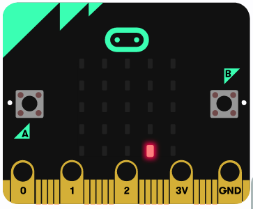
